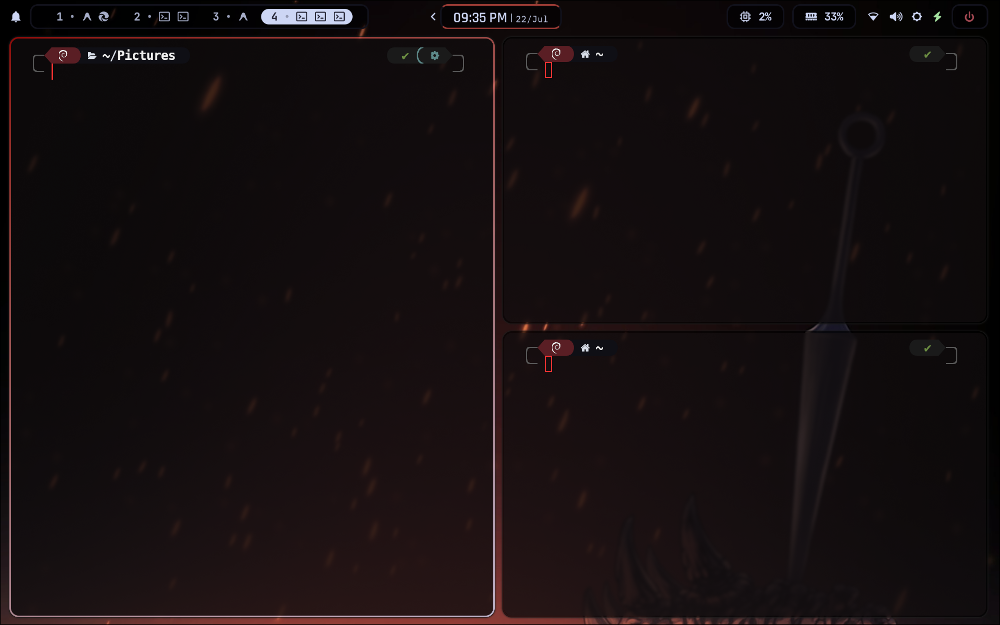
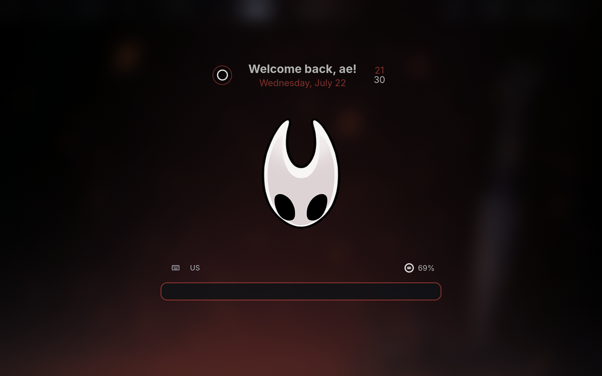
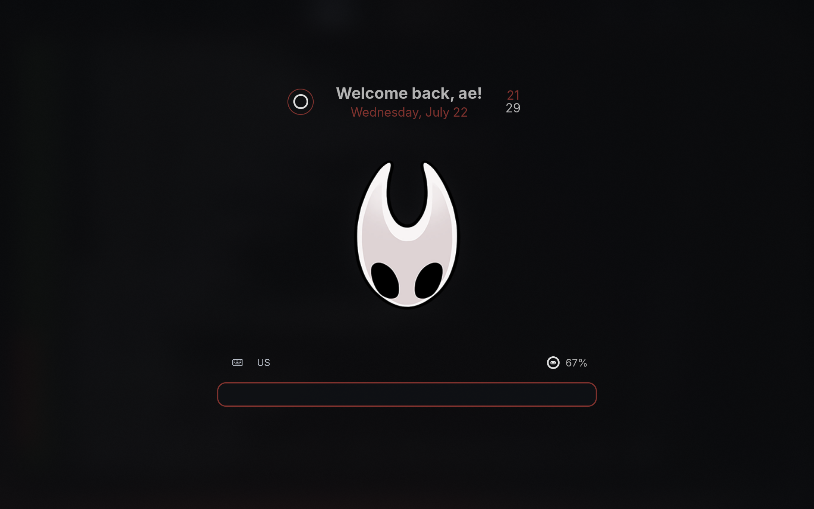
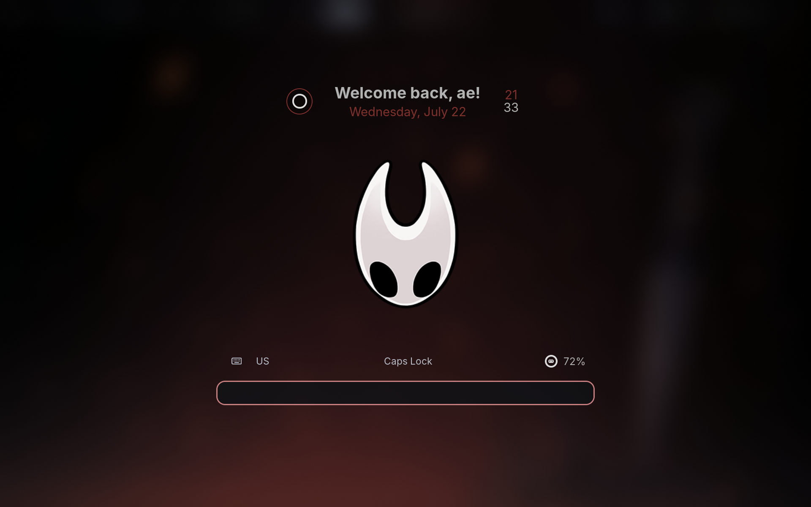

<div align="center">

<br/>

```
 ██████╗ ██╗██╗      █████╗ ███████╗
██╔════╝ ██║██║     ██╔══██╗██╔════╝
███████╗ ██║██║     ███████║█████╗  
╚════██║ ██║██║     ██╔══██║██╔══╝  
███████║ ██║███████╗██║  ██║███████╗
╚══════╝ ╚═╝╚══════╝╚═╝  ╚═╝╚══════╝
```

# hypr-silae-theme

**A dark, modular Hyprland configuration for Debian — inspired by the Silksong Game .**

[](https://hyprland.org/)
[](https://github.com/hyprwm/hyprlock)
[](https://github.com/hyprwm/hypridle)
[](./LICENSE)
[](https://www.debian.org/)

🌐 **Language:** English | [Español](./README.es.md)

</div>

---

## Preview

<div align="center">

### Desktop



### Lockscreen



<details>
<summary><b>More screenshots →</b></summary>
<br/>



*Lockscreen with black background*



*Caps Lock active notification on the lockscreen*

</details>

</div>

---

## ✦ What is this?

**hypr-silae-theme** is a modular configuration for the Hypr ecosystem that is available on debian repositories, so, consider the syntax version <b>(and overall the hyprland version)</b> may be older than rolling-release distros like arch linux. So in case of any issues, try to update the packages manually, i think there are some translators for that, but idk the details.


> **⚠ Scope of the repository**
>
> This configuration covers **only** the tools of the `hypr*` ecosystem.
> It does not include configuration of other tools of the desktop environment.
>
> | ✅ Included | ❌ Not included |
> |------------|--------------|
> | `hyprland.conf` — main compositor configuration | Any Status Bar |
> | `hyprlock.conf` — lock screen configuration | Any app launcher |
> | `hypridle.conf` — inactivity management configuration | Any notification daemon |
>
> If you are looking for a complete desktop environment *rice*, this repository is only one piece of the puzzle, maybe by the time you're reading this, I already add a waybar config or other tools on different repositories, check my github profile.

---

## ✦ Installation

> [!WARNING]
> Consider that this config was made to work with the following versions:
> - Hyprland : `0.54.3 built from branch v0.54.3 `
> - Hyprlock : `v0.9.5`
> - Hypridle : `v0.1.7` 


### Prerequisites

If you want that all the keybindings works as expected you need to install some packages. The name may vary depending on your distribution. The following list is for Debian


- [`Hyprland`](https://hyprland.org/) — Wayland compositor (window manager)
- [`hyprlock`](https://github.com/hyprwm/hyprlock) — lock screen
- [`hypridle`](https://github.com/hyprwm/hypridle) — inactivity daemon
- [`swaybg`](https://github.com/swaywm/swaybg) — wallpaper utility
- [`wl-clipboard`](https://github.com/wl-clipboard/wl-clipboard) — clipboard utility
- [`dunst`](https://github.com/dunst-project/dunst) — notification daemon
- [`grim`](https://github.com/emilk/grim) — screenshots utility
- [`slurp`](https://github.com/emilk/slurp) — selection utility
- [`cliphist`](https://github.com/sentriz/cliphist) — clipboard history utility
- [`wofi`](https://hg.sr.ht/~scoopta/wofi) — applications launcher

### Steps

**1. Clone the repository into your Hypr configuration directory:**

```bash
# Make a backup if you already have existing config
cp -r ~/.config/hypr ~/.config/hypr.bak

# Clone the repository
git clone https://github.com/Aert8/hypr-silae-theme ~/.config/hypr
```

**2. Launch Hyprland.**

The `hyprland.conf` file acts as an entry point and automatically loads all modules of the `silae` theme. No additional steps are required.

**3. (Optional) Customize the modules:**

```bash
# Path to edit the default programs (in case you don't want to install extra aplications)
~/.config/hypr/themes/silae/hyprland/config/programs.conf

# Path to edit the color palette
~/.config/hypr/themes/silae/hyprland/colors/colors.conf

# Path to edit the keyboard shortcuts (also here you can modify the aplication to execute given a keybind)
~/.config/hypr/themes/silae/hyprland/config/keybindings.conf

# Path to edit the lockscreen appearance
~/.config/hypr/themes/silae/hyprlock/config/
```

---

## ✦ hypridle Configuration

The [`hypridle.conf`](./hypridle.conf) file manages the system's behavior when idle.

The base configuration includes:

| Event | Behavior |
|-------|----------|
| Close lid / sleep | Lock the session (`loginctl lock-session`) |
| Wake from sleep | Reactivate the screen (`hyprctl dispatch dpms on`) |

Optional listeners are **commented** by default (because i don't use them). To activate them, uncomment the corresponding block in `hypridle.conf`:

```ini
# Block after 5 minutes of inactivity
listener {
    timeout = 300
    on-timeout = loginctl lock-session
}

# Turn off screen after 5.5 minutes
listener {
    timeout = 330
    on-timeout = hyprctl dispatch dpms off
    on-resume  = hyprctl dispatch dpms on
}

# Suspend after 1 hour
listener {
    timeout = 3600
    on-timeout = systemctl suspend
}
```

---

## ✦ Lock screen (hyprlock)

The lockscreen is fully modularized in `themes/silae/hyprlock/`. Each visual element lives in its own file:

| Module | Description |
|--------|-------------|
| `top_card.conf` | User, date and time |
| `logo.conf` | Central icon (default: Hornet face :P) |
| `bottom_card.conf` | Keyboard layout and battery level |
| `input_field.conf` | Password field |
| `background.conf` | Background with blur effect |

To modify any element, simply edit the corresponding module without affecting the rest.

---

## ✦ License

Distributed under the **MIT** license. See [`LICENSE`](./LICENSE) for more information.

---

<div align="center">

*Let's define with the heart*


</div>
